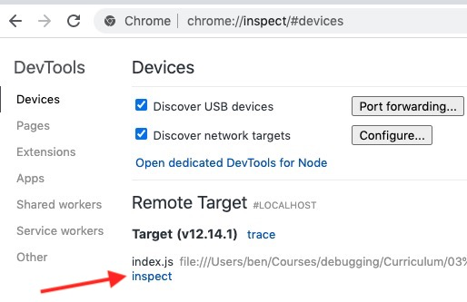

# Desk Lamp Debugger Demo

This code accompanies my tutorial for using the Chrome Debugger with Node.js, which can be found [here](https://ben-wilhelm.teachable.com/courses/debugging-strategies-and-tactics1/lectures/17884257).

## Running the code

This was authored using Node.js version 12, though it should run with any modern version of Node.

Simply install dependencies...

```
npm install
```

...and run the script:

```
node index.js
```

## Debugging the code

As demonstrated in the video, to debug with the Chrome DevTools debugger, start the script with the `--inspect-brk` flag

```
node --inspect-brk index.js
```

Then from Chrome visit chrome://inspect.

Under "Remote Target", click the "inspect" link for the appropriate file.


